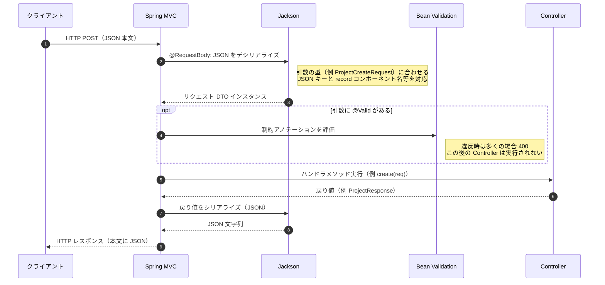

# プレイグラウンド教材: DTO・Record・`@PostMapping`・出口DTO（本プロジェクトと切り離して試す）

この文書は **ApiSampleServer とは別の、壊してもよい小さなプロジェクト** で手を動かしながら読む前提のメモです。  
今日やらなくてよいです。時間のあるときに **30〜60分単位** で進めてください。

---

## 0. なぜプレイグラウンドか

本番寄りのプロジェクトでは、Security・JPA・JWT などが同時に絡み、「JSON が届いた／届かない」の原因が分散しやすいです。  
まずは **Web の層だけ**（JSON 受け取り → 検証 → JSON 返す）に絞ると、DTO と Record の感覚が掴みやすくなります。

---

## 1. 用語の整理（短く）

### 1.1 DTO（Data Transfer Object）

- **レイヤの境界でデータを運ぶための型**です。
- HTTP では本文が **JSON** なので、「その JSON の形」を Java で表したものが **リクエストDTO／レスポンスDTO** です。
- **Entity と別**にするのは、API で公開する項目・検証ルールを **意図的に限定**するためです。

### 1.2 Record と Lombok の違い（混同しやすい点）

| 観点 | `record` | Lombok（`@Getter` など） |
|------|----------|-------------------------|
| 正体 | **Java言語機能**（Java 16+） | **アノテーション処理でコード生成** |
| 主な用途 | **不変のデータ載せ** | 可変クラスのボイラープレート削減 |
| ミュータビリティ | 基本 **不変**（コンポーネントは final 相当） | クラス設計次第で可変になりやすい |
| JSON との相性 | 相性が良い（コンストラクタ引数＝フィールド） | 問題なく使えるが、可変だと注意点が増える |

**結論**: 「便利さ」は似ていますが、**record は言語のデータ表現、Lombok は生成ツール**です。どちらか一方だけが必須ではありません。

### 1.3 `@PostMapping` が Record（DTO）と「つながる」理由

**命名規約マジックではありません。**  
**どの Java 型にマップするかはメソッド引数で決まり**、Spring MVC が **JSON との往復（Jackson）** と **任意の検証（Bean Validation）** を挟みます。

#### シーケンス図（典型フロー）



#### 図の読み方（先ほどの 1〜4 行と対応）

| ステップ | 図中の意味 |
|----------|------------|
| 1 | クライアントが `POST` で JSON 本文を送る |
| 2 | `@RequestBody` により、本文が **引数の型**へデシリアライズされる（Jackson） |
| 3 | `@Valid` があれば、その DTO に対して Bean Validation が走る |
| 4 | メソッドの戻り値が **JSON レスポンス**にシリアライズされる（Jackson） |

**一言でいうと**、**型を決めているのはあなた（DTO / record の定義とメソッド引数）。Spring がその型と JSON を行き来させている**、という関係です。

### 1.4 昔の SessionBean / EntityBean になぞらえないほうがよい理由

- **SessionBean**: サーバ上の **会話状態** を持つ世界の話。
- **EntityBean / JPA Entity**: **永続化（DB行）** の話。
- **今の `@PostMapping` の引数**: 基本 **その1リクエストの寿命** のオブジェクト（ステートレスAPIならリクエスト終了で捨てる）。

イメージとして近いのは、かつての **「フォーム用の ActionForm」や「画面間を運ぶフォームDTO」** 寄りで、**セッションやテーブル行そのものではない**、と捉えるとブレにくいです。

---

## 2. プレイグラウンドの作り方（推奨）

### 2.1 新規プロジェクトを作る

1. Spring Initializr で **別ディレクトリ** に新規生成する。  
   依存は最小でよい例:
   - Spring Web
   - Validation
   - （任意）Spring Boot DevTools  
2. **この ApiSampleServer の `pom.xml` をコピーしない**。依存が増えるほど原因が散らばります。

パッケージ例: `com.example.playground`

### 2.2 最初に入れるコード（最小）

**起動クラス**だけの状態から、次の3ファイルを追加するイメージです。

1. リクエストDTO（record + Validation）
2. レスポンスDTO（record）
3. `@RestController` に `@PostMapping` 1本

**ポイント**: 最初は **DB・Security・JPA を入れない**。下記は **`POST /api/echo`** の最小例です。

前提:

- **Java 17+**（`record` を使うため）
- Initializr のパッケージを **`com.example.playground`** にするか、下記の `package` 行を自分のベースパッケージに合わせて **一括置換**する
- 起動クラス（`@SpringBootApplication`）が **`com.example.playground` 配下**にあり、コンポーネントスキャンに **Controller が含まれる**こと

#### ファイル1: リクエストDTO（record + Validation）

`src/main/java/com/example/playground/EchoRequest.java`

```java
package com.example.playground;

import jakarta.validation.constraints.NotBlank;
import jakarta.validation.constraints.Size;

public record EchoRequest(
    @NotBlank
    @Size(max = 100)
    String name,
    @Size(max = 500)
    String note
) {}
```

#### ファイル2: レスポンスDTO（record）

`src/main/java/com/example/playground/EchoResponse.java`

```java
package com.example.playground;

public record EchoResponse(
    String status,
    String name,
    String note
) {}
```

#### ファイル3: Controller（`@PostMapping` 1本）

`src/main/java/com/example/playground/EchoController.java`

```java
package com.example.playground;

import org.springframework.http.ResponseEntity;
import org.springframework.web.bind.annotation.PostMapping;
import org.springframework.web.bind.annotation.RequestBody;
import org.springframework.web.bind.annotation.RequestMapping;
import org.springframework.web.bind.annotation.RestController;

import jakarta.validation.Valid;

@RestController
@RequestMapping("/api")
public class EchoController {

    @PostMapping("/echo")
    public ResponseEntity<EchoResponse> echo(@Valid @RequestBody EchoRequest req) {
        var body = new EchoResponse("ok", req.name(), req.note() == null ? "" : req.note());
        return ResponseEntity.ok(body);
    }
}
```

#### 動作確認（PowerShell・ポートはデフォルト 8080 想定）

```powershell
'{"name":"abc","note":"hello"}' | Set-Content -NoNewline -Encoding utf8 request.json
curl.exe -i -X POST "http://localhost:8080/api/echo" -H "Content-Type: application/json" --data-binary "@request.json"
```

期待（例）: HTTP 200 と、本文に `name` / `note` がエコーされた JSON。

`name` を空文字にすると、`@NotBlank` により **400** になる（実験Bの入口）。  
この3ファイルだけでは **400 のJSON形式は Spring のデフォルト**になります（ApiSampleServer の `GlobalExceptionHandler` のような独自形は未導入）。

---

## 3. 実験カリキュラム（壊してよい順）

### 実験A: JSON が Record に入ることを確認する

- `POST /api/echo`  
- 本文: `{"name":"abc","note":"hello"}`
- サーバ側で `EchoRequest record(String name, String note)` を受け取り、ログに `name()` を出す。

**試すこと**

- JSON のキーを **`name` → `Name`** に変えて何が起きるか（設定なしだと失敗しやすい）
- 余計なキー `extra` を付けたときの挙動（通常は無視されやすい）

### 実験B: `@Valid` の前後

- `name` に `@NotBlank` を付ける。
- `name: ""` や `name` 欠落で **400** になることを確認する。
- `@Valid` を外すと **400 にならない**ことを確認する（検証が走らない）。

### 実験C: 入口DTOと出口DTOを分ける

- リクエスト: `CreateItemRequest(name, quantity)`  
- レスポンス: `CreateItemResponse(id, name, quantity)`（`id` はサーバが `UUID.randomUUID()` で付与したふり）

**狙い**

- 「クライアントが送ってよいもの」と「サーバが返してよいもの」が **意図的に違う**ことを体験する。

### 実験D: 可変クラス + Lombok と record を並べて比較（任意）

- 同じJSONを受ける **Lombok `@Data` クラス版** と **record版** を別エンドポイントに用意する。
- 片方で `setName` 後にログを出すなど、**可変性の違い**を見る。

### 実験E: Entity を混ぜない戒め

- プレイグラウンドに **`@Entity` を入れない**期間を長めに取る。  
  DTO と JSON の対応が固まってから JPA を足すと、混乱が減ります。

---

## 4. よくある誤解（チェックリスト）

- 「DTO というアノテーションがあるわけではない」→ **ただの設計上の呼び方**。
- 「`@PostMapping` が record を特別扱い」→ **特別扱いではなく、`@RequestBody` の型に過ぎない**。
- 「名前が `*Request` だから動く」→ **慣習**。動く本質は **Jackson のマッピング**。
- 「Session に入れるBeanと同じ」→ **基本は違う**（ステートレスAPIではリクエストスコープ）。

---

## 5. 本プロジェクト（ApiSampleServer）に戻るときの見方

- `ProjectCreateRequest` / `ProjectResponse` は **JSON の形**を Java で固定している。
- `@Valid` は **Bean Validation を起動するスイッチ**。
- `GlobalExceptionHandler` は **400 のJSONエラー形**を揃える役。

プレイグラウンドで A〜C まで終えたあとに読み直すと、第3章の文脈にスッと載りやすくなります。

---

## 6. 次に足してもよい拡張（余力が出たら）

- `application.properties` で `spring.jackson.property-naming-strategy` や `FAIL_ON_UNKNOWN_PROPERTIES` を触って、**JSONとJavaの厳密さ**を理解する。
- OpenAPI（Swagger）で **リクエスト/レスポンススキーマ**を可視化する（別章の延長）。

---

このファイルは **学習用メモ**です。プレイグラウンドのコードは Git で別ブランチにする、フォルダごと削除する、など好きにしてください。
